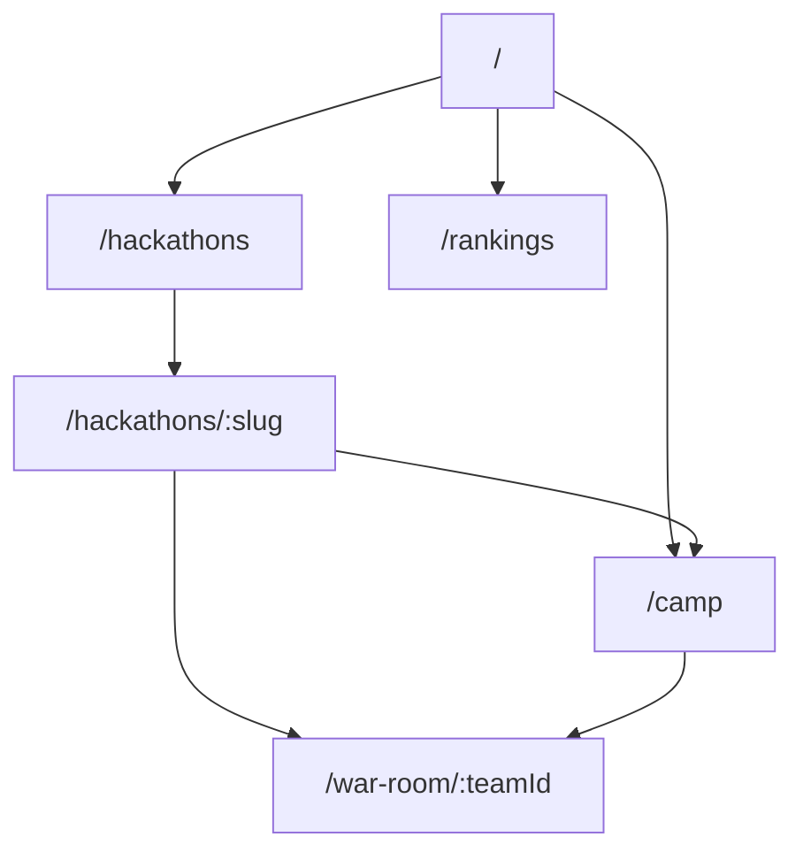
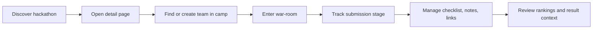
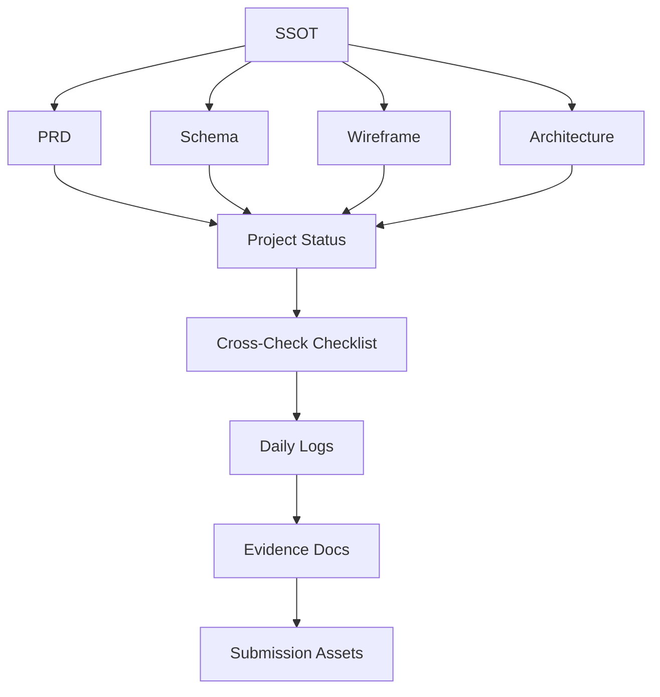

# Expedition Hub

Expedition Hub is a reusable hackathon operations portal built around one end-to-end flow:

`discover hackathons -> form a team -> prepare submission -> understand results`

The current build is focused on six core routes, browser-local persistence with `localStorage`, and a reviewer-friendly public flow that connects into a team-local war-room experience.

## Current Build Status

- Product: `Expedition Hub`
- Focus hackathon: `daker-handover-2026-03`
- Stack: `Next.js 16 + TypeScript + Tailwind v4 + localStorage`
- Core routes implemented:
  - `/`
  - `/hackathons`
  - `/hackathons/:slug`
  - `/camp`
  - `/rankings`
  - `/war-room/:teamId`
- Validation completed:
  - `npm run lint`
  - `npm run build`
  - Playwright responsive QA pass with follow-up mobile overflow fix
  - privacy boundary evidence pass
  - desktop drag-and-drop sanity confirmation
- Current phase: `Phase 2 - QA + extension`

## Product Shape

- Public portal:
  - landing, hackathon discovery, detail, rankings
- Team-local flow:
  - camp entry into war-room
  - basecamp summary
  - submission stage tracking
  - workflow board
  - checklist, notes, link management
- Data boundary:
  - public routes show public entities only
  - team-local state lives in browser storage
  - private-hidden fields must never render

## Route Overview

| Route | Purpose | Current status |
| --- | --- | --- |
| `/` | Landing and portal entry | done |
| `/hackathons` | Hackathon directory and filter flow | done |
| `/hackathons/:slug` | 8-section detail experience | done |
| `/camp` | Team recruitment, creation, scoped camp flow | done |
| `/rankings` | Global ranking board | done |
| `/war-room/:teamId` | Team-local submission preparation hub | done |

## Visual Maps

### Route Map



### User Flow



### Document And Evidence Map



## Source Of Truth

- Canonical source:
  - [docs/ref/hackathons/daker-handover-2026-03.md](docs/ref/hackathons/daker-handover-2026-03.md)

## Key Documents

- Product definition:
  - [docs/Prd.md](docs/Prd.md)
  - [docs/schema.md](docs/schema.md)
  - [docs/wireframe.md](docs/wireframe.md)
  - [docs/architecture-diagrams.md](docs/architecture-diagrams.md)
- Project tracking:
  - [docs/status/PROJECT-STATUS.md](docs/status/PROJECT-STATUS.md)
  - [docs/status/PAGE-UPGRADE-BOARD.md](docs/status/PAGE-UPGRADE-BOARD.md)
  - [docs/status/CROSS-CHECK-CHECKLIST.md](docs/status/CROSS-CHECK-CHECKLIST.md)
- Planning:
  - [ai-context/master-plan.md](ai-context/master-plan.md)
  - [docs/plans/daker-handover-master-plan.md](docs/plans/daker-handover-master-plan.md)
  - [docs/plans/expedition-hub-submission-1-draft.md](docs/plans/expedition-hub-submission-1-draft.md)

## Evidence Assets

- Daily logs:
  - [docs/daily/2026-03-09/portal-doc-system-bootstrap.md](docs/daily/2026-03-09/portal-doc-system-bootstrap.md)
  - [docs/daily/2026-03-09/dayker-war-room-redefinition.md](docs/daily/2026-03-09/dayker-war-room-redefinition.md)
  - [docs/daily/2026-03-10/phase-1-complete-and-phase-2-handoff-sync.md](docs/daily/2026-03-10/phase-1-complete-and-phase-2-handoff-sync.md)
  - [docs/daily/2026-03-10/cross-check-checklist-created.md](docs/daily/2026-03-10/cross-check-checklist-created.md)
- Evidence docs:
  - [docs/evidence/dev-process-phase0.md](docs/evidence/dev-process-phase0.md)
  - [docs/evidence/dev-process-phase1b-navigation-and-camp-flow.md](docs/evidence/dev-process-phase1b-navigation-and-camp-flow.md)
  - [docs/evidence/responsive-qa-phase2-playwright-2026-03-10.md](docs/evidence/responsive-qa-phase2-playwright-2026-03-10.md)
  - [docs/evidence/war-room-drag-and-privacy-verification-2026-03-10.md](docs/evidence/war-room-drag-and-privacy-verification-2026-03-10.md)
  - [docs/evidence/ssot-strict-alignment-2026-03-10.md](docs/evidence/ssot-strict-alignment-2026-03-10.md)

## Design References

- Page references:
  - [public/design_reference/landing_page.png](public/design_reference/landing_page.png)
  - [public/design_reference/hackathon_listing.png](public/design_reference/hackathon_listing.png)
  - [public/design_reference/hackathon_detail.png](public/design_reference/hackathon_detail.png)
  - [public/design_reference/camp_recruitment.png](public/design_reference/camp_recruitment.png)
  - [public/design_reference/rankings.png](public/design_reference/rankings.png)
  - [public/design_reference/war_room.png](public/design_reference/war_room.png)
- Shared component reference:
  - [public/design_reference/1.png](public/design_reference/1.png)

## Local Development

```bash
npm install
npm run dev
```

Useful validation commands:

```bash
npm run lint
npm run build
```

## Current Gaps

- Real-device phone QA is still missing.
- The stricter public submit handoff flow still needs one focused browser pass.
- Deployment evidence, final submission copy, and PDF packaging assets are intentionally deferred until the build is closer to freeze.

## Notes

- The product is intentionally `localStorage`-first. No backend is required for the current judging scope.
- War-room is a submission-preparation hub, not a full real-time collaboration suite.
- Documentation is treated as judging evidence, not only as internal notes.
