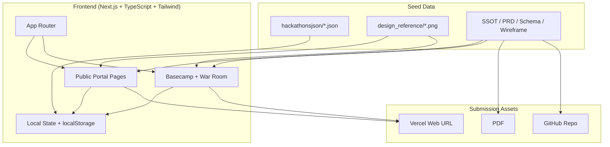
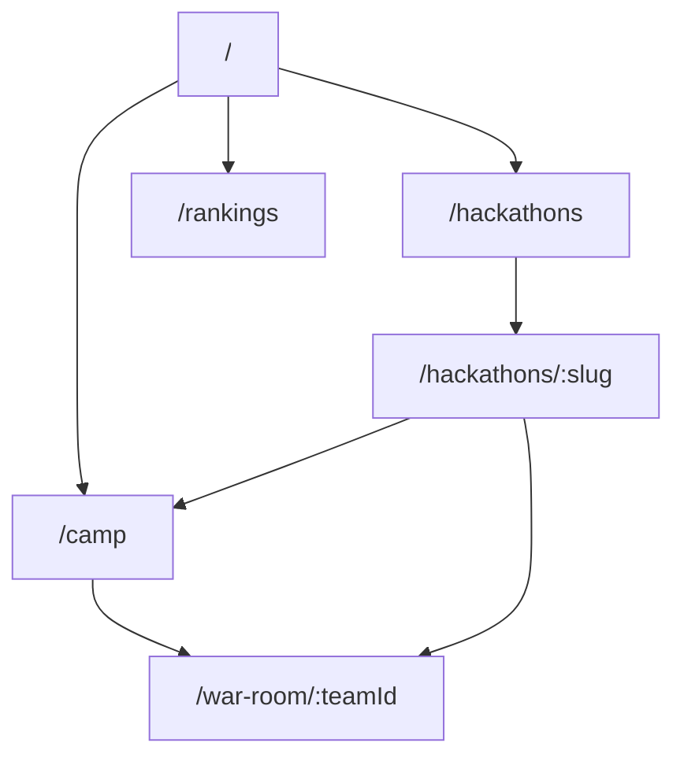
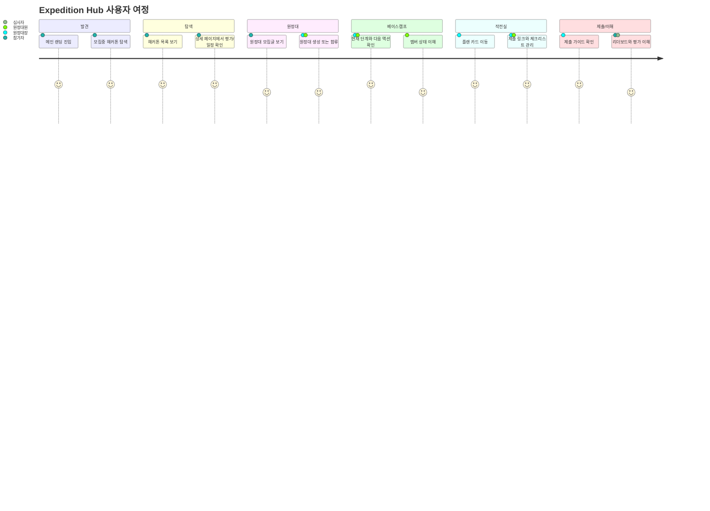
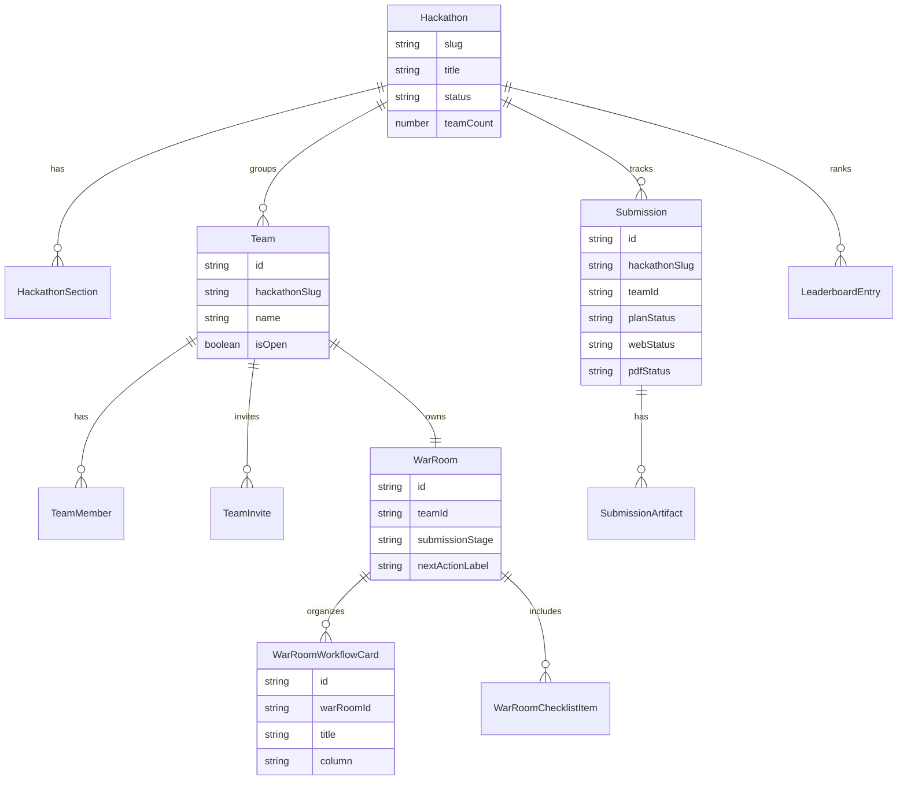
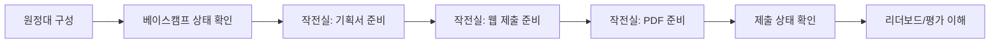
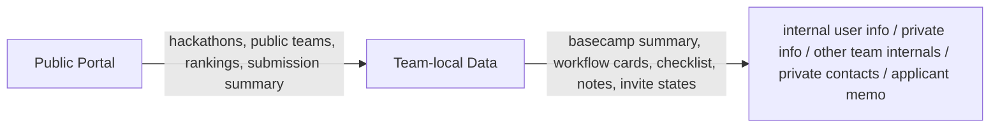
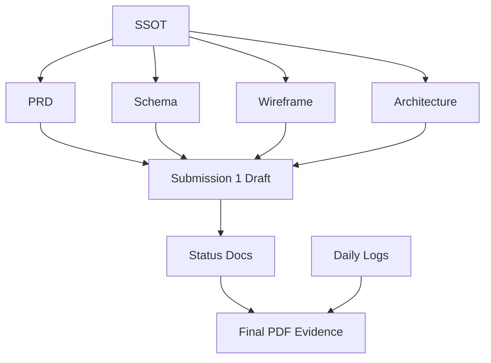

# Expedition Hub Architecture Diagrams

Expedition Hub 해커톤 실행 포털용 Mermaid 다이어그램 모음.

---

## 1. System Architecture

---

## 2. Route Map

---

## 3. User Journey

---

## 4. Local Data ERD

---

## 5. Submission Flow

---

## 6. Privacy Boundaries

---

## 7. Automation & Evidence Flow

---

## 8. Missing-Check Nodes
- [ ] 상단바 이동
- [ ] 상태 UI 3종
- [ ] 상세 섹션 8개
- [ ] 베이스캠프 요약
- [ ] 작전실 워크플로우 보드
- [ ] 제출 상태
- [ ] `미제출`
- [ ] GitHub + Vercel 연결
